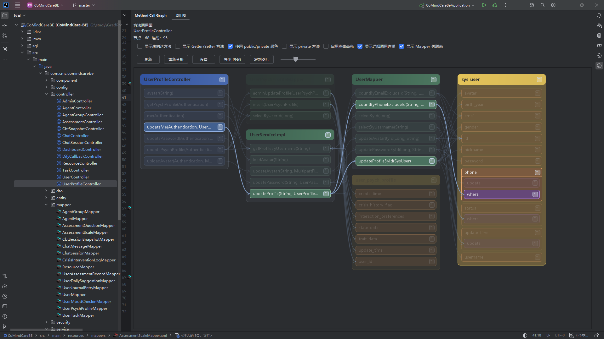
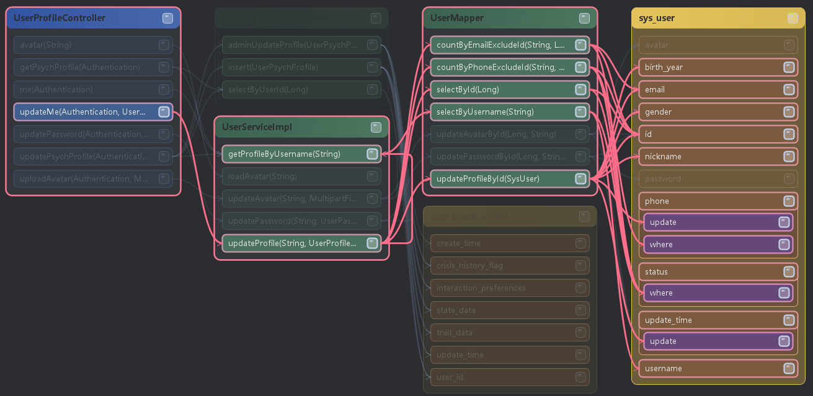
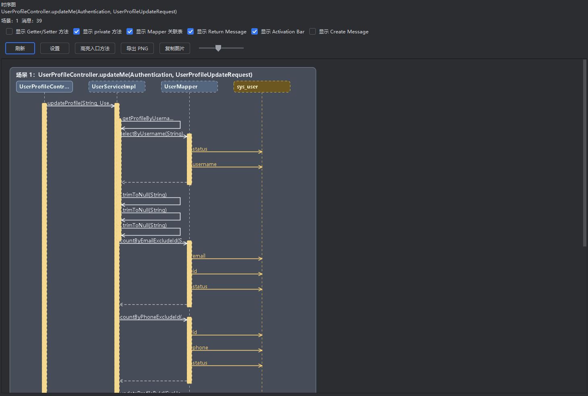
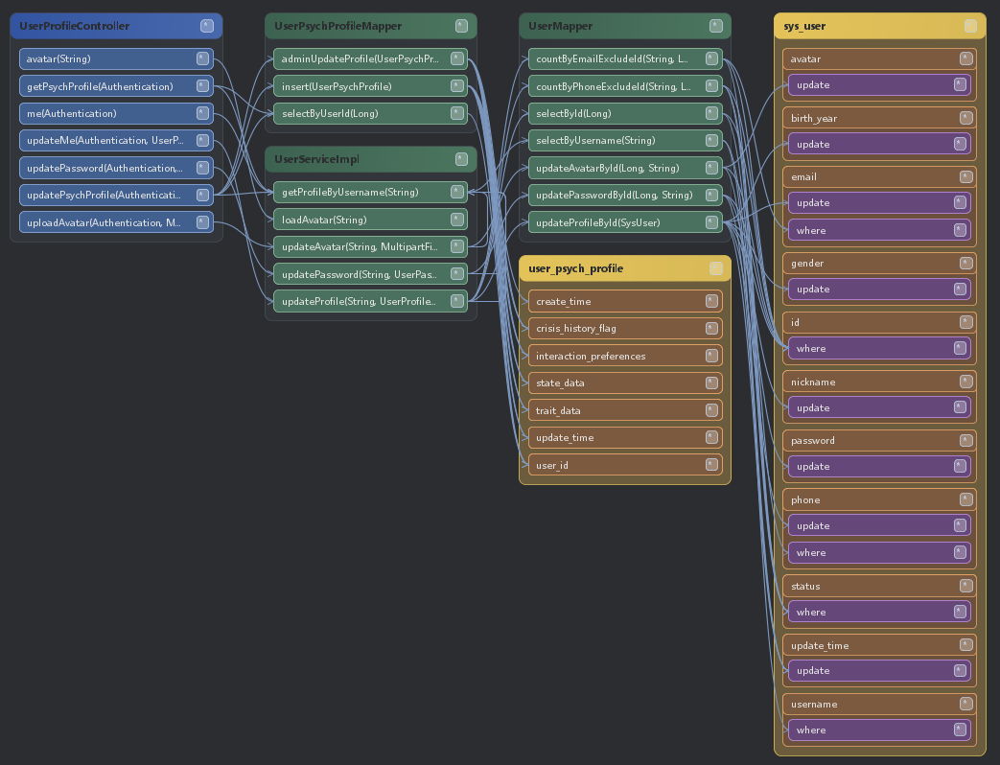
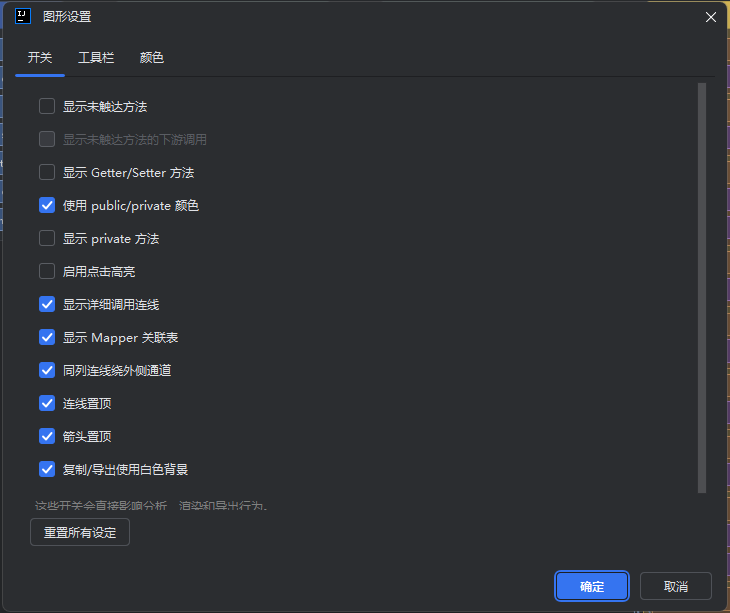

# Rinne IDEA Toolkit

[English](README.md) | [简体中文](README.zh-CN.md)

一款 IntelliJ IDEA 插件，用于直接在 IDE 内探索 Java 调用图、时序图以及 MyBatis 数据库映射关系。



## 概述

Rinne IDEA Toolkit 可以帮助你在不离开 IntelliJ IDEA 的情况下，从选中的 Java 类出发查看静态调用关系。

该插件面向 Java 项目设计，尤其适合如下分层风格的项目：

- `Controller -> Service -> Mapper`
- 同类中的 helper / util 调用链
- MyBatis Mapper XML 或注解 SQL 映射

## V1 版本亮点

- 在编辑器或项目视图中分析当前选中的 Java 类
- 以“类分组”的方式展示分层方法调用图
- 支持高亮或仅显示调用路径、上游、下游与完整调用链
- 可选显示未触达方法，以及未触达方法继续调用的链路
- 支持 getter/setter 方法与 private 方法显示开关
- 可在同一 Tool Window 中为方法打开独立时序图标签页
- 支持将调用图和时序图导出为图片或复制为图片
- 展示 MyBatis `Mapper -> 表 -> 字段` 映射
- 可将数据库字段进一步展开为 `select`、`where`、`update`、`join`、`group by`、`order by`、`having` 等 SQL 动作
- 支持工具栏可见项、图形选项以及亮色/暗色配色独立配置

## 主要功能

### 1. 方法调用图

- 以选中类中声明的方法作为分析入口
- 递归展开项目内 Java 方法调用
- 以类为单位分组节点，提升图谱可读性
- 双击方法节点即可跳转源码
- 支持单击高亮、右键路径操作、缩放、滚轮滚动以及画布拖动

### 2. 路径聚焦模式

- 高亮当前路径
- 仅显示当前路径
- 高亮完整调用链
- 仅显示完整调用链
- 高亮上游调用链
- 仅显示上游调用链
- 高亮下游调用链
- 仅显示下游调用链

这些模式同时支持：

- 方法
- 类
- 数据库表
- 数据库字段

### 3. 时序分析

- 可从方法右键菜单直接打开
- 以新标签页形式显示，不会替换当前调用图
- 基于静态分析构建“上游 + 下游”的完整时序场景
- 当一个方法存在多个上游入口时，会按场景分段展示
- 支持导出、复制、缩放与独立设置

### 4. MyBatis 数据库映射

插件可以将 Mapper 方法静态扩展到数据库结构：

- `Mapper 方法 -> 表`
- `Mapper 方法 -> 字段`
- 展开后的 `字段 -> SQL 动作`

支持来源：

- MyBatis XML Mapper
- MyBatis 注解 SQL

当前支持的字段动作类别：

- `select`
- `insert`
- `update`
- `where`
- `join`
- `group by`
- `order by`
- `having`

### 5. 设置与自定义

- 调用图选项页
- 工具栏显示项页
- 颜色设置页
- 亮色 / 暗色主题分开配置
- 调用图与时序图设置会持久化保存

## 使用方式

### 分析一个类

1. 在编辑器或项目树中选中一个 Java 类。
2. 执行 `Analyze Method Calls`。
3. 打开或聚焦 `Method Call Graph` 工具窗口。
4. 通过右键菜单或节点小按钮查看路径关系。

### 打开时序图

1. 在调用图中右键某个方法节点。
2. 选择 `Sequence Analysis`。
3. 该方法的时序图会以新标签页形式在同一 Tool Window 中打开。

### 查看 Mapper、表与字段

1. 打开 `Show Mapper Tables`。
2. 在调用图右侧查看 Mapper 对应的表与字段。
3. 右键某个表字段可以展开字段动作。
4. 右键某张表可以展开或收起当前表下所有已显示字段的动作节点。

## 截图

### 方法调用图


建议展示内容：

- Controller / Service / Mapper 分层关系
- 图谱工具栏
- 类分组与方法节点

### 路径聚焦与高亮



建议展示内容：

- 右键聚焦菜单
- 单击高亮效果
- 完整调用链或上下游过滤效果

### 时序分析



建议展示内容：

- 多场景分段
- 参与者生命线
- 时序图工具栏

### Mapper 表与字段映射



建议展示内容：

- Mapper 到数据库表的扩展
- 表卡片中的字段
- 字段展开后的 `select` / `where` 等动作

### 设置窗口



建议展示内容：

- 开关选项页
- 工具栏显示项页
- 亮色 / 暗色配色页

## 当前范围

V1 已包含：

- Java 源码分析
- 基于 PSI 的静态遍历
- 项目内调用图遍历
- MyBatis XML 与注解 SQL 解析
- 调用图与时序图可视化

V1 暂不包含：

- Kotlin 混合调用链分析
- 运行时代理 / AOP 解析
- 反射执行链追踪
- 运行时 SQL 还原
- 真实数据库元数据读取

## 安装

### 从本地文件安装

1. 使用 Gradle 构建插件 ZIP。
2. 打开 IntelliJ IDEA。
3. 进入 `Settings/Preferences -> Plugins`。
4. 点击右上角齿轮按钮。
5. 选择 `Install Plugin from Disk...`。
6. 选择生成的 ZIP 文件。

### 开发常用命令

```bash
./gradlew build
./gradlew runIde
./gradlew test
```

## 项目结构

```text
src/main/kotlin/.../actions         IDEA 动作与入口
src/main/kotlin/.../services        PSI 分析、图构建、偏好设置服务
src/main/kotlin/.../toolWindow      Swing UI、调用图渲染、时序图渲染
src/main/kotlin/.../model           图模型、时序模型、偏好模型
src/main/resources/messages         国际化资源
src/test/kotlin/...                 插件测试
docs/images/                        README 截图资源
```

## V1 发布说明

- 首个公开版本
- Java-only 静态分析
- 内置调用图与时序图 Tool Window
- MyBatis 表、字段、字段动作可视化
- 支持跟随 IDEA 语言自动切换为英文 / 简体中文
